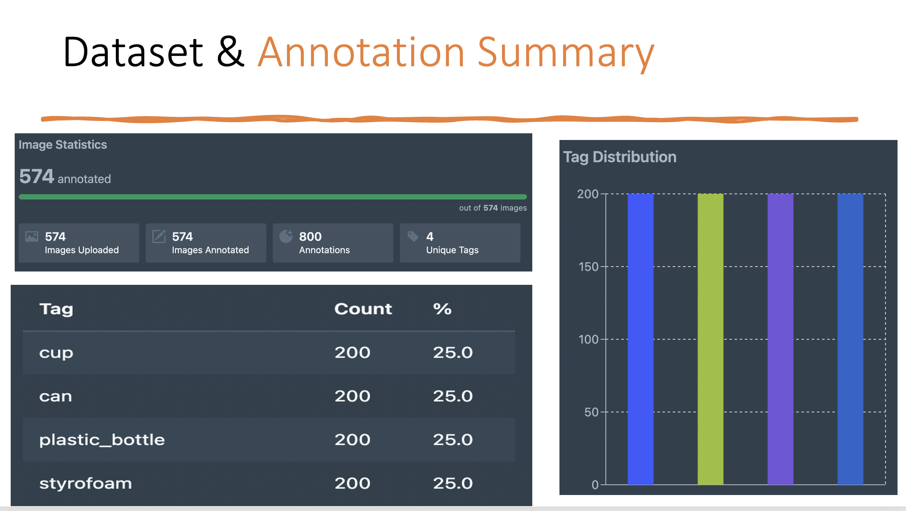
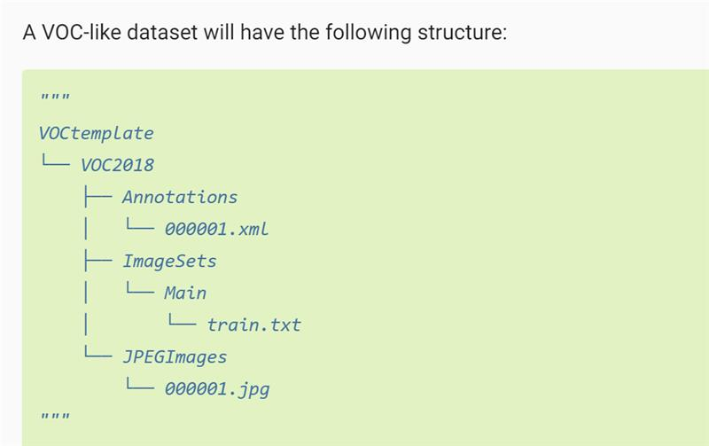
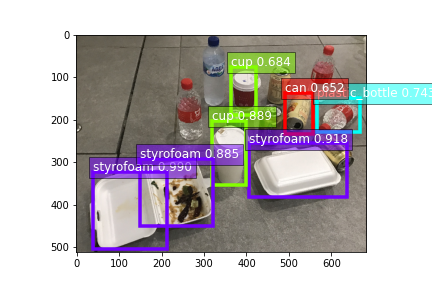

# recyclables-are-all-we-need

## Overview

project: recyclables-are-all-we-need

- (1) Use `Datature` to do the annotations and train YOLO, EfficientNet, FasterRCNN 
- (2) Fine-tune SSD Mobilnet 

## Dataset 

`data` folder contains images in .jpg format and annotations in Pascal VOC format. 
Pipeline has to follow:

## Datature
- Official Website is here: https://www.datature.io/
- We use Datature to do annotations, train and compare model performances
	- please check `Datature` folder for performance image
	- model checkpoints link : https://drive.google.com/drive/folders/1NAavLOxcnSC2QbIeSpcmH9Yi-PL7nilO?usp=share_link

## SSD Mobilenet
- sample result

